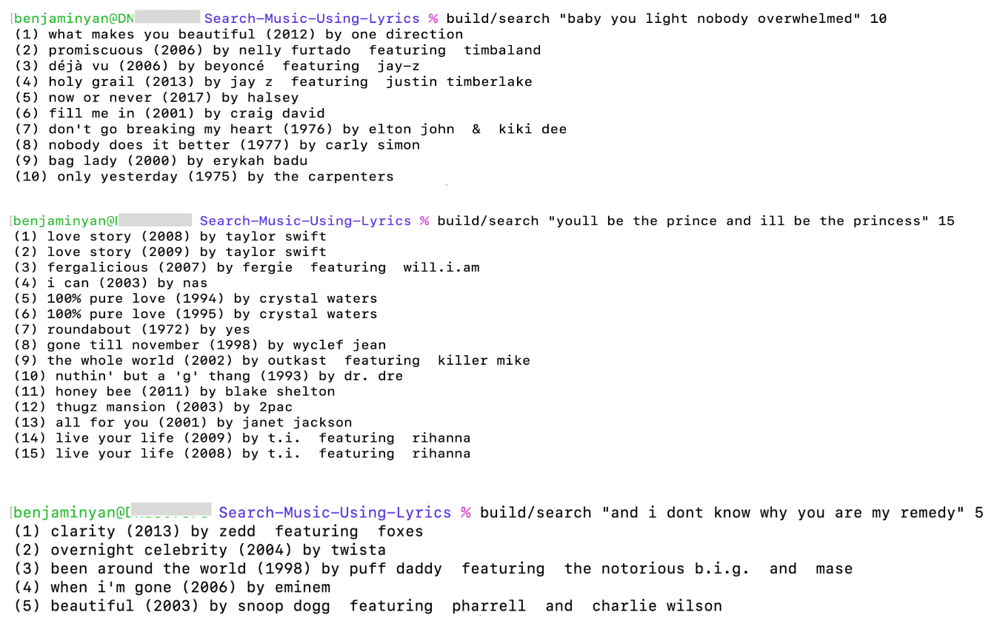

# Search-Music-Using-Lyrics

## Description
This program is designed to assist people who have a song that keeps playing in their head and happens to know a few catchy lyrics, but can't quite remember its name. More specifically, this program takes a search query, interprets it as a sequence of plausible song keywords, and identifies / ranks songs that best match those keywords. The song data is acquired from the Billboard Top 100 over the last half century. 


<br/>

## Installation 
In the directory you want the repository to be located, run:
```
git clone https://github.com/yanbenjamin/Search-Music-Using-Lyrics.git
cd Search-Music-Using-Lyrics
```
Make sure that your computer has the C++ compiler g++ with version at least 11. Then, to produce the executables, run 
```
make clean
make
```
This will create two executables, `build/search` and `build/test_data_processor`, located in the   `build` directory. The latter can be used for debugging and ensuring the program is extracting the correct information (song names, lyrics, artist names, etc.) from the data file `billboard-lyrics.csv`. The executable `build/search` is used to directly search for songs. 

## Searching for Songs
For instance, if one recalled the lyrics **"baby ive been ive been losing sleep dreaming"** and wanted the program to print 10 candidate songs (ranked by the algorithm by how much the lyrics match the query), they would run 
```
build/search "baby ive been ive been losing sleep dreaming" 10 
```
You can also run it to print more candidate songs if needed. As a note, make sure to put quotation marks around the lyrics and avoid punctuation as the dataset has been largely cleaned of those characters. 

<br/>

Below are some example runs using the `build/search` executable to identify forgotten songs. 



## Key Source Files 

| File    | Main Contents
| -------------         | ------------- 
| `utils.h/cpp`       | Includes helper functions for analyzing and manipulating strings and vector.
| `process_song_data.cpp/h`                 | Includes tools for reading the lyrics csv file and encoding the song information in data strctures. 
| `build_data_maps.cpp/h`                | Used for creating "dictionaries" that map words to songs that contain them and map songs to their lyrics. 
| `generate_queue.cpp/h`                 | Creates an STL C++ priority queue that ranks songs according to a query based on (1) how many words in the query appear in the song and (2) how frequent those word in the song are. 
| `search.cpp`                | Contains the main program for providing fragmented lyrics and getting ranked search results for plausible songs.    
| `test_data_processor.cpp`                 | A testing and debugging program for ensuring that the information is being read correctly form the csv file. 


